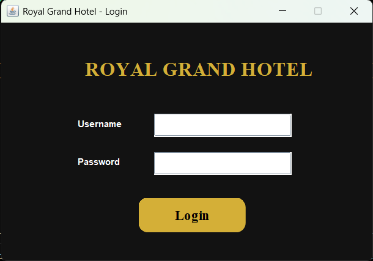
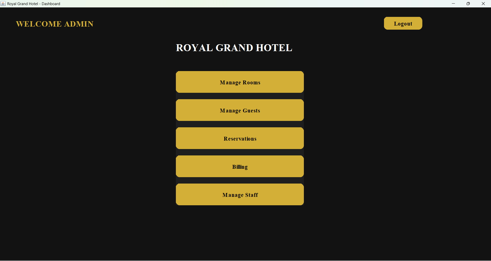
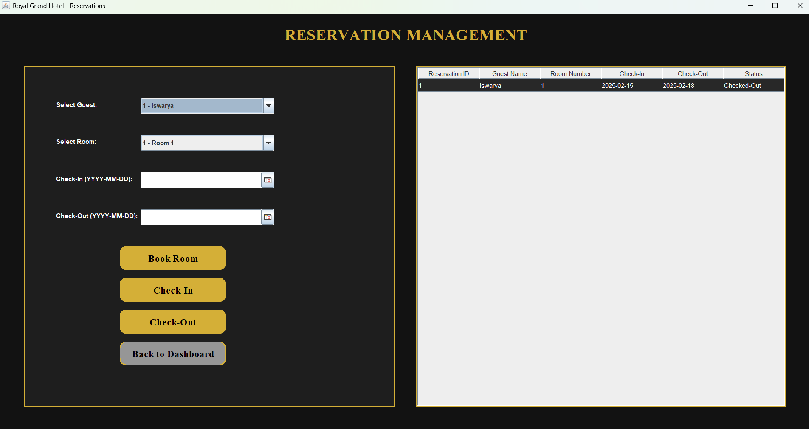
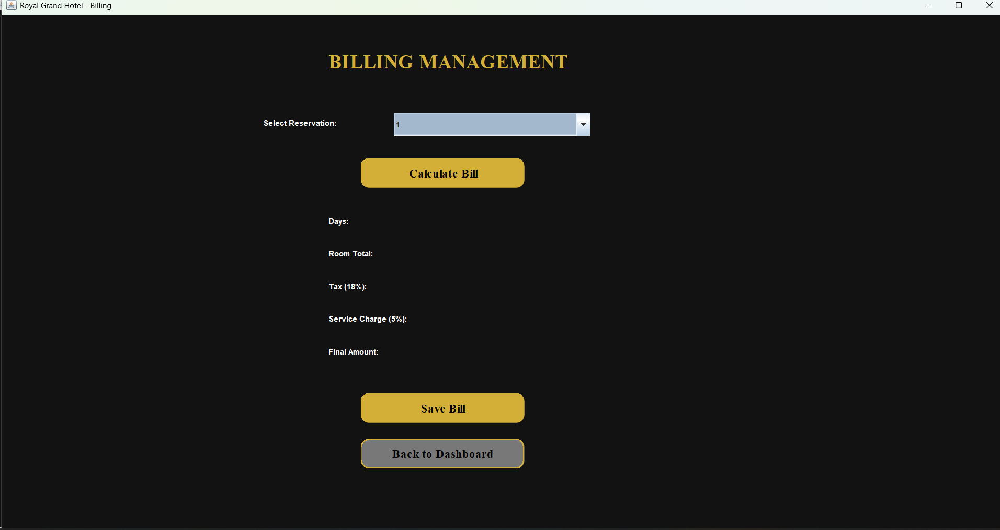

# Hotel Management System

A Java Swing based Hotel Management System designed to manage hotel operations including room booking, billing, and reservations.

## Features
- Login Authentication
- Room Management
- Reservation System
- Billing System
- Database Integration (MySQL)

## Technologies Used
- Java
- Swing
- JDBC
- MySQL

## Project Structure
main - Application entry point
ui - User interface forms
dao - Database operations
util - Database connection
## Screenshots

### Login Page

### Dashboard

### Reservation

### Billing

